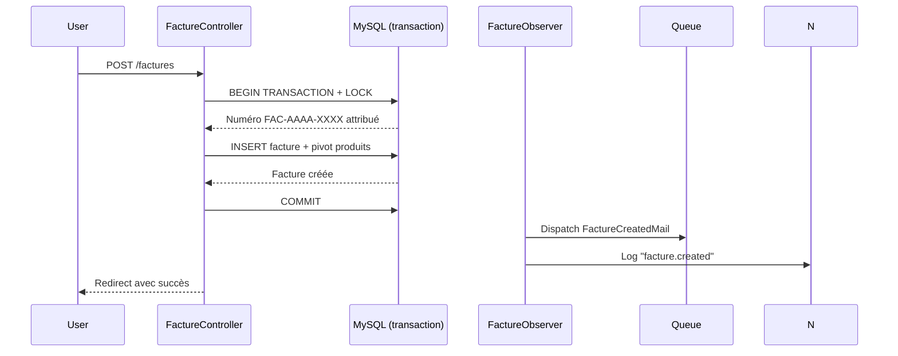
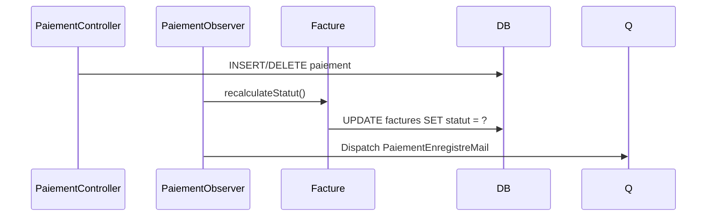
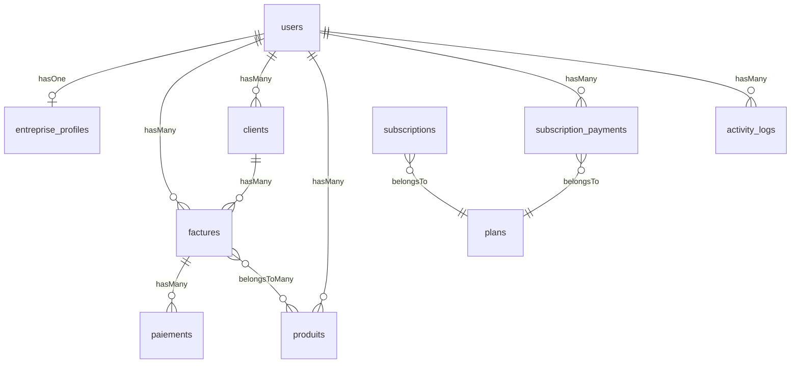

# Document de Design Technique — Gestion Commerciale Complète

## Vue d'ensemble

Ce document décrit l'architecture technique pour compléter le SaaS de gestion commerciale (Laravel 12, MySQL, Tailwind CSS, Alpine.js, DomPDF). Les 12 exigences couvrent : numérotation des factures, statuts automatiques, profil entreprise, PDF professionnel, page publique partageable, historique d'abonnements, pagination, recherche/filtres, emails transactionnels, logs d'activité, vérification email et sécurité renforcée.

L'approche retenue privilégie les mécanismes natifs Laravel (Observers, Policies, Mailables, Queues, MustVerifyEmail) pour minimiser les dépendances externes et maximiser la maintenabilité.

---

## Architecture

### Vue d'ensemble des couches

```mermaid
graph TD
    subgraph "Couche Présentation"
        A[Blade Views + Alpine.js]
        B[Page Publique /factures/public/{token}]
    end

    subgraph "Couche Application"
        C[Controllers HTTP]
        D[Form Requests]
        E[Policies Laravel]
        F[Mailables + Queue]
    end

    subgraph "Couche Domaine"
        G[Eloquent Models]
        H[Observers Eloquent]
        I[Scopes de recherche]
    end

    subgraph "Couche Infrastructure"
        J[MySQL]
        K[Storage / Filesystem]
        L[Queue Worker]
        M[DomPDF]
        N[spatie/laravel-activitylog]
    end

    A --> C
    B --> C
    C --> D
    C --> E
    C --> G
    G --> H
    H --> F
    F --> L
    G --> I
    G --> J
    C --> M
    C --> K
    H --> N
```

### Flux de création d'une facture



### Flux de mise à jour du statut



---

## Composants et Interfaces

### Nouveaux Models

| Model | Table | Rôle |
|---|---|---|
| `EntrepriseProfile` | `entreprise_profiles` | Profil entreprise lié à un User (hasOne) |
| `SubscriptionPayment` | `subscription_payments` | Historique transactions FedaPay |

### Observers Eloquent

| Observer | Modèle écouté | Actions |
|---|---|---|
| `PaiementObserver` | `Paiement` | `created`, `deleted` → recalcule statut Facture + dispatch mail |
| `FactureObserver` | `Facture` | `creating` → génère numéro + public_token ; `created` → dispatch mail + log |
| `ClientObserver` | `Client` | `created/updated/deleted` → log activité |
| `ProduitObserver` | `Produit` | `created/updated/deleted` → log activité |

### Policies Laravel

| Policy | Modèle | Méthodes |
|---|---|---|
| `FacturePolicy` | `Facture` | `view`, `update`, `exportPdf` |
| `ClientPolicy` | `Client` | `view`, `update`, `delete` |
| `ProduitPolicy` | `Produit` | `view`, `update`, `delete` |
| `PaiementPolicy` | `Paiement` | `view`, `delete` |
| `EntrepriseProfilePolicy` | `EntrepriseProfile` | `view`, `update` |
| `ActivityLogPolicy` | — | `viewAny` (Premium uniquement) |

### Mailables

| Mailable | Déclencheur | Destinataire |
|---|---|---|
| `FactureCreatedMail` | Création facture | User |
| `PaiementEnregistreMail` | Création paiement | User |

### Scopes Eloquent

```php
// Client
scopeSearch($query, $term)   // LIKE sur nom et email

// Facture
scopeFilterClient($query, $term)
scopeFilterDateRange($query, $from, $to)
scopeFilterStatut($query, $statut)

// Produit
scopeSearch($query, $term)   // LIKE sur nom
```

### Routes nouvelles

```
GET  /factures/public/{token}          → FacturePublicController@show  (sans auth)
GET  /entreprise/profil                → EntrepriseProfileController@edit
PUT  /entreprise/profil                → EntrepriseProfileController@update
GET  /abonnements/historique           → SubscriptionController@history
GET  /activite                         → ActivityLogController@index     (Premium)
```

---

## Modèles de Données

### Modifications table `factures`

```sql
ALTER TABLE factures
  ADD COLUMN numero_facture VARCHAR(20) UNIQUE,
  ADD COLUMN statut ENUM('impayée','partiellement payée','payée') DEFAULT 'impayée',
  ADD COLUMN public_token CHAR(36) UNIQUE,
  ADD COLUMN conditions_paiement TEXT NULL;
```

- `numero_facture` : généré en transaction avec `SELECT MAX() FOR UPDATE` pour éviter les collisions
- `statut` : recalculé par `PaiementObserver`, stocké pour permettre le filtrage SQL
- `public_token` : UUID v4 généré à la création, non modifiable

### Nouvelle table `entreprise_profiles`

```sql
CREATE TABLE entreprise_profiles (
  id              BIGINT UNSIGNED AUTO_INCREMENT PRIMARY KEY,
  user_id         BIGINT UNSIGNED NOT NULL UNIQUE,
  nom             VARCHAR(255) NOT NULL,
  logo_path       VARCHAR(500) NULL,
  adresse         TEXT NULL,
  telephone       VARCHAR(50) NULL,
  email           VARCHAR(255) NULL,
  numero_fiscal   VARCHAR(100) NULL,
  created_at      TIMESTAMP,
  updated_at      TIMESTAMP,
  FOREIGN KEY (user_id) REFERENCES users(id) ON DELETE CASCADE
);
```

### Nouvelle table `subscription_payments`

```sql
CREATE TABLE subscription_payments (
  id              BIGINT UNSIGNED AUTO_INCREMENT PRIMARY KEY,
  user_id         BIGINT UNSIGNED NOT NULL,
  plan_id         BIGINT UNSIGNED NULL,
  montant         DECIMAL(10,2) NOT NULL,
  devise          VARCHAR(10) DEFAULT 'XOF',
  statut          ENUM('réussie','échouée','en attente') NOT NULL,
  reference_fedapay VARCHAR(255) NULL,
  created_at      TIMESTAMP,
  updated_at      TIMESTAMP,
  FOREIGN KEY (user_id) REFERENCES users(id) ON DELETE CASCADE,
  FOREIGN KEY (plan_id) REFERENCES plans(id) ON DELETE SET NULL
);
```

### Modification table `users`

```sql
ALTER TABLE users
  ADD COLUMN email_verified_at TIMESTAMP NULL;
  -- Activer MustVerifyEmail sur le model User
```

### Table `activity_logs` (alternative à spatie si non installé)

```sql
CREATE TABLE activity_logs (
  id              BIGINT UNSIGNED AUTO_INCREMENT PRIMARY KEY,
  user_id         BIGINT UNSIGNED NOT NULL,
  action          VARCHAR(100) NOT NULL,   -- ex: "facture.created"
  subject_type    VARCHAR(100) NULL,       -- ex: "App\Models\Facture"
  subject_id      BIGINT UNSIGNED NULL,
  description     TEXT NULL,
  created_at      TIMESTAMP,
  FOREIGN KEY (user_id) REFERENCES users(id) ON DELETE CASCADE
);
CREATE INDEX idx_activity_logs_user_created ON activity_logs(user_id, created_at);
```

Purge automatique via `php artisan schedule:run` avec une commande `PurgeOldActivityLogs` (> 90 jours).

### Génération du numéro de facture

```php
// Dans FactureObserver::creating()
DB::transaction(function () use ($facture) {
    $year = now()->year;
    $last = Facture::where('user_id', $facture->user_id)
        ->whereYear('created_at', $year)
        ->lockForUpdate()
        ->max('numero_facture');

    $next = $last ? ((int) substr($last, -4)) + 1 : 1;
    $facture->numero_facture = sprintf('FAC-%d-%04d', $year, $next);
    $facture->public_token   = (string) Str::uuid();
});
```

### Recalcul du statut de facture

```php
// Dans PaiementObserver::created() et deleted()
public function recalculateStatut(Facture $facture): void
{
    $paye = $facture->paiements()->sum('montant');
    $statut = match(true) {
        $paye <= 0              => 'impayée',
        $paye >= $facture->total => 'payée',
        default                 => 'partiellement payée',
    };
    $facture->updateQuietly(['statut' => $statut]);
}
```

### Diagramme des relations




---

## Propriétés de Correction

*Une propriété est une caractéristique ou un comportement qui doit être vrai pour toutes les exécutions valides d'un système — c'est essentiellement un énoncé formel de ce que le système doit faire. Les propriétés servent de pont entre les spécifications lisibles par l'humain et les garanties de correction vérifiables par machine.*

### Propriété 1 : Format du numéro de facture

*Pour toute* facture créée par n'importe quel utilisateur, le champ `numero_facture` doit correspondre au format `FAC-AAAA-XXXX` où `AAAA` est l'année de création (4 chiffres) et `XXXX` est un entier à 4 chiffres avec zéros de remplissage.

**Valide : Exigences 1.1**

---

### Propriété 2 : Unicité des numéros de facture

*Pour tout* ensemble de factures créées par le même utilisateur la même année (y compris en cas de créations concurrentes), tous les `numero_facture` doivent être distincts — aucun doublon ne doit exister.

**Valide : Exigences 1.2, 1.3**

---

### Propriété 3 : Immuabilité du numéro de facture

*Pour toute* facture existante, toute tentative de modification du champ `numero_facture` après création doit être ignorée ou rejetée, et la valeur originale doit être préservée.

**Valide : Exigences 1.4**

---

### Propriété 4 : Cohérence statut / paiements

*Pour toute* facture et tout ensemble de paiements associés, le statut stocké doit correspondre exactement à la règle : `impayée` si somme des paiements = 0, `partiellement payée` si 0 < somme < total, `payée` si somme ≥ total — et ce après chaque création ou suppression de paiement.

**Valide : Exigences 2.1, 2.2, 2.4**

---

### Propriété 5 : Unicité du profil entreprise par utilisateur

*Pour tout* utilisateur, il ne peut exister qu'un seul enregistrement dans `entreprise_profiles` lié à cet utilisateur — toute tentative de création d'un second profil doit être rejetée ou fusionnée avec l'existant.

**Valide : Exigences 3.4**

---

### Propriété 6 : Validation du logo uploadé

*Pour tout* fichier soumis comme logo d'entreprise, seuls les fichiers de type MIME `image/jpeg`, `image/png` ou `image/webp` d'une taille inférieure ou égale à 2 Mo doivent être acceptés — tout autre fichier doit être rejeté avec un message d'erreur explicite.

**Valide : Exigences 3.3, 12.6**

---

### Propriété 7 : Détection de profil incomplet

*Pour tout* profil entreprise, la fonction de détection "profil incomplet" doit retourner `true` si et seulement si au moins un des champs obligatoires (nom, adresse, téléphone, email, numéro fiscal) est absent ou vide.

**Valide : Exigences 3.5**

---

### Propriété 8 : Contenu du PDF généré

*Pour toute* facture appartenant à un utilisateur avec `pdf_enabled = true`, le PDF généré doit contenir : le numéro de facture, le nom du client, le tableau des produits, le total, le montant payé, le reste à régler et le statut.

**Valide : Exigences 4.1, 4.3**

---

### Propriété 9 : Unicité des tokens publics de facture

*Pour tout* ensemble de factures créées, tous les `public_token` doivent être distincts — aucun doublon ne doit exister dans la table `factures`.

**Valide : Exigences 5.1**

---

### Propriété 10 : Isolation des données via token public

*Pour tout* token valide, la page publique `/factures/public/{token}` ne doit retourner que les données de la facture correspondant à ce token — aucune donnée d'une autre facture ou d'un autre client ne doit être exposée.

**Valide : Exigences 5.5**

---

### Propriété 11 : Persistance des transactions d'abonnement

*Pour tout* événement webhook FedaPay confirmé, un enregistrement doit être créé dans `subscription_payments` avec les champs montant, devise, statut, référence FedaPay et plan — et la relecture de cet enregistrement doit retourner les mêmes valeurs.

**Valide : Exigences 6.1, 6.4**

---

### Propriété 12 : Ordre décroissant de l'historique d'abonnement

*Pour tout* utilisateur ayant des transactions d'abonnement, la liste retournée par la page d'historique doit être triée par `created_at` décroissant — pour toute paire d'éléments consécutifs (i, i+1), `created_at[i] >= created_at[i+1]`.

**Valide : Exigences 6.2**

---

### Propriété 13 : Taille de page de pagination

*Pour toute* liste (clients, produits, factures, paiements) contenant plus de 15 éléments, la première page retournée doit contenir exactement 15 éléments, et les métadonnées de pagination doivent inclure le total réel et la page courante.

**Valide : Exigences 7.1, 7.3**

---

### Propriété 14 : Conservation des filtres dans la pagination

*Pour tout* ensemble de paramètres de filtre actifs, les liens de pagination générés doivent contenir ces mêmes paramètres — naviguer vers une autre page ne doit pas perdre les filtres.

**Valide : Exigences 7.4**

---

### Propriété 15 : Correction du filtrage par terme partiel

*Pour tout* terme de recherche `t` et toute liste de clients ou produits, chaque élément retourné doit contenir `t` (insensible à la casse) dans son nom ou email — et aucun élément ne contenant pas `t` ne doit apparaître dans les résultats.

**Valide : Exigences 8.1, 8.3**

---

### Propriété 16 : Correction du filtrage des factures

*Pour tout* filtre appliqué sur les factures (client, plage de dates, statut), chaque facture retournée doit satisfaire tous les critères actifs simultanément.

**Valide : Exigences 8.2**

---

### Propriété 17 : Reset des filtres retourne tous les éléments

*Pour tout* utilisateur, une requête sans paramètres de filtre doit retourner tous les éléments lui appartenant (dans la limite de la pagination).

**Valide : Exigences 8.5**

---

### Propriété 18 : Dispatch email asynchrone sur événements CRUD

*Pour toute* création de facture ou enregistrement de paiement, un job Mailable doit être dispatchés dans la queue — aucun email ne doit être envoyé synchroniquement dans le thread HTTP principal.

**Valide : Exigences 9.1, 9.2, 9.4**

---

### Propriété 19 : Traçabilité des actions CRUD dans les logs

*Pour toute* action de création, modification ou suppression sur les entités Client, Facture, Produit, Paiement ou EntrepriseProfile, un enregistrement doit être créé dans `activity_logs` avec l'identifiant de l'utilisateur, l'action, le type et l'identifiant de l'entité concernée, et la date/heure.

**Valide : Exigences 10.1, 10.5**

---

### Propriété 20 : Purge des logs après 90 jours

*Pour tout* enregistrement dans `activity_logs`, après exécution de la commande de purge, seuls les enregistrements dont `created_at` est inférieur à 90 jours avant la date courante doivent être supprimés — les enregistrements plus récents doivent être préservés.

**Valide : Exigences 10.4**

---

### Propriété 21 : Restriction d'accès pour utilisateurs non vérifiés

*Pour tout* utilisateur dont `email_verified_at` est null, toute requête vers une route protégée par `verified` doit retourner une redirection vers la page de vérification — aucune fonctionnalité principale ne doit être accessible.

**Valide : Exigences 11.2**

---

### Propriété 22 : Ownership check sur toutes les ressources

*Pour tout* utilisateur A tentant d'accéder à une ressource (Facture, Client, Produit, Paiement, EntrepriseProfile) appartenant à un utilisateur B (A ≠ B), la réponse HTTP doit être 403 — aucune donnée de B ne doit être retournée.

**Valide : Exigences 12.1, 12.3**

---

### Propriété 23 : Rejet des entrées invalides

*Pour tout* formulaire de l'application, toute soumission contenant des données ne respectant pas les règles de validation définies (type, longueur, format, existence en base) doit retourner une réponse d'erreur de validation — aucune donnée invalide ne doit être persistée.

**Valide : Exigences 12.4**

---

## Gestion des Erreurs

### Erreurs HTTP et comportements attendus

| Situation | Code HTTP | Comportement |
|---|---|---|
| Accès à une ressource d'un autre user | 403 | Message "Accès non autorisé" |
| Token public invalide | 404 | Page d'erreur standard |
| PDF demandé sans pdf_enabled | 403 | Redirection vers page d'abonnement |
| Logs demandés sans plan Premium | 403 | Message "Fonctionnalité Premium" |
| Fichier logo invalide (type/taille) | 422 | Erreur de validation avec message explicite |
| Rate limit dépassé | 429 | Message "Trop de requêtes" |
| Email non vérifié sur route protégée | 302 | Redirection vers /email/verify |
| Lien de vérification expiré | 403 | Page avec bouton "Renvoyer l'email" |

### Gestion des erreurs d'email

Les Mailables sont dispatchés dans la queue `database`. En cas d'échec :
- Laravel retente automatiquement 3 fois (configurable via `$tries`)
- Après épuisement des tentatives, le job est déplacé dans `failed_jobs`
- Un log d'erreur est écrit via `Log::error()` dans le handler `failed()` du job
- Le flux HTTP principal n'est jamais interrompu

### Gestion des collisions de numéros de facture

La génération du numéro utilise `DB::transaction()` avec `lockForUpdate()` sur la requête `MAX()`. En cas de deadlock MySQL, Laravel relance automatiquement la transaction (via `DB::transaction()` avec retry). Si la transaction échoue après les retries, une exception est propagée et la facture n'est pas créée.

---

## Stratégie de Tests

### Approche duale

Les tests combinent deux approches complémentaires :

- **Tests unitaires / d'intégration** : vérifient des exemples précis, cas limites et conditions d'erreur
- **Tests basés sur les propriétés (PBT)** : vérifient les propriétés universelles sur des entrées générées aléatoirement

### Bibliothèque PBT

**[Eris](https://github.com/giorgiosironi/eris)** — bibliothèque PHP de property-based testing compatible PHPUnit.

```bash
composer require --dev giorgiosironi/eris
```

Configuration : minimum **100 itérations** par test de propriété.

### Tests unitaires / d'intégration (PHPUnit + Laravel TestCase)

Exemples précis à couvrir :

- `FactureController@exportPdf` retourne 403 si `pdf_enabled = false` (Propriété 8 / Exigence 4.2)
- `GET /factures/public/{token_invalide}` retourne 404 (Exigence 5.3)
- `GET /factures/public/{token_valide}` retourne 200 sans authentification (Exigence 5.2)
- Inscription → email de vérification dispatché (Exigence 11.1)
- Clic sur lien valide → `email_verified_at` non null (Exigence 11.3)
- Lien expiré → page avec option de renvoi (Exigence 11.4)
- User non Premium → 403 sur `/activite` (Exigence 10.3)
- 61ème requête → 429 (Exigence 12.5)
- Échec d'envoi email → pas d'exception propagée (Exigence 9.3)
- PDF sans logo → génération réussie (Exigence 4.4)

### Tests de propriétés (Eris / PBT)

Chaque propriété de correction doit être implémentée par **un seul test de propriété**.

Format de tag obligatoire dans chaque test :
```
// Feature: gestion-commerciale-complete, Property {N}: {texte de la propriété}
```

| Test | Propriété | Générateurs |
|---|---|---|
| Format numéro facture | P1 | User aléatoire, date aléatoire |
| Unicité numéros facture | P2 | N créations pour le même user/année |
| Immuabilité numéro | P3 | Facture + tentative de mise à jour |
| Cohérence statut/paiements | P4 | Facture + liste de paiements aléatoires |
| Unicité profil entreprise | P5 | User + N tentatives de création |
| Validation logo | P6 | Fichiers de types/tailles variés |
| Détection profil incomplet | P7 | Profils avec champs manquants aléatoires |
| Contenu PDF | P8 | Factures avec produits/clients aléatoires |
| Unicité tokens publics | P9 | N factures créées |
| Isolation données publiques | P10 | Token valide + autres factures |
| Persistance transactions | P11 | Payloads webhook FedaPay aléatoires |
| Ordre historique abonnement | P12 | N transactions avec dates aléatoires |
| Taille page pagination | P13 | Listes de taille > 15 |
| Conservation filtres pagination | P14 | Paramètres de filtre aléatoires |
| Filtrage terme partiel | P15 | Termes et listes de clients/produits |
| Filtrage factures | P16 | Filtres combinés et factures aléatoires |
| Reset filtres | P17 | Utilisateur avec N éléments |
| Dispatch email asynchrone | P18 | Créations de factures/paiements |
| Traçabilité logs CRUD | P19 | Actions CRUD sur toutes les entités |
| Purge logs 90 jours | P20 | Logs avec dates variées |
| Restriction non vérifié | P21 | Users avec email_verified_at null |
| Ownership check | P22 | Paires (user A, ressource de user B) |
| Rejet entrées invalides | P23 | Données invalides générées |

### Organisation des fichiers de tests

```
tests/
├── Unit/
│   ├── FactureNumberGeneratorTest.php
│   ├── FactureStatutCalculatorTest.php
│   └── EntrepriseProfileValidatorTest.php
├── Feature/
│   ├── FacturePublicPageTest.php
│   ├── PdfExportTest.php
│   ├── EmailVerificationTest.php
│   ├── ActivityLogAccessTest.php
│   └── RateLimitingTest.php
└── Property/
    ├── FactureNumberPropertyTest.php
    ├── FactureStatutPropertyTest.php
    ├── PaginationPropertyTest.php
    ├── SearchFilterPropertyTest.php
    ├── OwnershipPropertyTest.php
    └── ActivityLogPropertyTest.php
```
